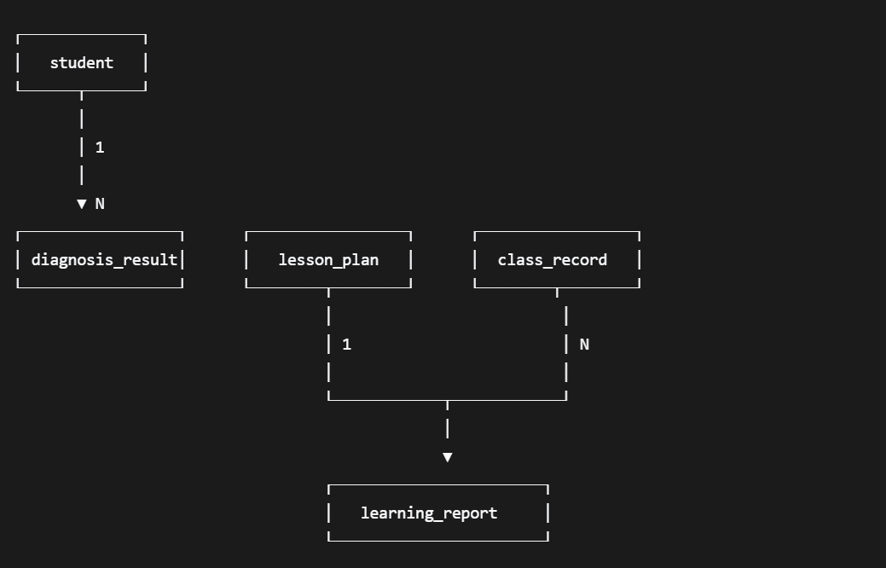

# 智教星瞳 · 后端服务

> **版本**：v0.3.0  
> **负责人**：成员 E  
> **最后更新**：2026-04-22

---

## 📑 目录

- [智教星瞳 · 后端服务](#智教星瞳--后端服务)
  - [📑 目录](#-目录)
  - [1. 项目简介](#1-项目简介)
  - [2. GitHub 协作指南](#2-github-协作指南)
    - [2.1 首次获取项目](#21-首次获取项目)
    - [2.2 获取最新更新](#22-获取最新更新)
    - [2.3 日常开发操作](#23-日常开发操作)
    - [2.4 分支协作建议](#24-分支协作建议)
    - [2.5 常见问题处理](#25-常见问题处理)
  - [3. 技术栈](#3-技术栈)
  - [4. 项目结构](#4-项目结构)
  - [5. 快速开始](#5-快速开始)
    - [5.1 环境要求](#51-环境要求)
    - [5.2 安装依赖](#52-安装依赖)
    - [5.3 配置环境变量](#53-配置环境变量)
    - [5.4 启动服务](#54-启动服务)
  - [6. 运行模式](#6-运行模式)
    - [6.1 Mock 模式](#61-mock-模式)
    - [6.2 真实 AI 模式](#62-真实-ai-模式)
  - [7. 核心 API 端点](#7-核心-api-端点)
    - [7.1 学生管理](#71-学生管理)
    - [7.2 诊断测试](#72-诊断测试)
    - [7.3 教案管理](#73-教案管理)
    - [7.4 课堂记录与实时调整](#74-课堂记录与实时调整)
    - [7.5 学习报告](#75-学习报告)
  - [8. 使用 Postman 测试](#8-使用-postman-测试)
  - [9. 数据库说明](#9-数据库说明)
    - [9.1 数据表概览](#91-数据表概览)
    - [9.2 ER 关系图](#92-er-关系图)
  - [10. 与蓝心大模型通信机制](#10-与蓝心大模型通信机制)
  - [11. 常见问题](#11-常见问题)
  - [12. 后续计划](#12-后续计划)
  - [13. 团队成员](#13-团队成员)
  - [14. 许可证](#14-许可证)

---

## 1. 项目简介

智教星瞳后端服务是为“智教星瞳”AI 自适应教学系统提供数据存储、业务逻辑处理及 AI 智能体调用的中间层。服务基于 **FastAPI** 构建，通过 **vivo 九问平台 API** 调用蓝心大模型能力，目前已实现以下核心功能：

- 学生档案管理
- **智能诊断题库**：优先本地题库缓存，不足时自动调用大模型生成并入库
- 个性化教案生成与版本管理
- 教学资源（PPT/板书/视频）自动生成
- **课堂实时数据记录**：专注度事件、随堂答题记录存储
- **实时教学调整决策**：根据课堂状态动态调整教学策略

当前版本支持 **Mock 模式**（返回模拟数据）与 **真实 AI 调用模式** 灵活切换，便于开发与调试。

---

## 2. GitHub 协作指南

项目已托管在 GitHub，团队成员可通过以下步骤获取代码并保持同步。

### 2.1 首次获取项目

```bash
# 克隆仓库到本地
git clone https://github.com/ubreakifix0925/zhihuixingtong_backend.git
cd zhihuixingtong_backend
```

### 2.2 获取最新更新

每次开始工作前，请先拉取团队其他成员的最新提交：

```bash
# 拉取远程主分支的最新代码并合并到本地
git pull origin main
```

如果本地有未提交的修改，建议先暂存：

```bash
git stash           # 暂存本地修改
git pull origin main
git stash pop       # 恢复本地修改
```

### 2.3 日常开发操作

```bash
# 1. 查看当前状态
git status

# 2. 添加修改的文件到暂存区
git add .                          # 添加所有修改
# 或
git add <文件名>                    # 添加指定文件

# 3. 提交修改（请编写清晰的提交信息）
git commit -m "feat: 新增XX功能"    # 新功能
git commit -m "fix: 修复XX问题"     # Bug修复
git commit -m "docs: 更新文档"      # 文档更新

# 4. 推送到远程仓库
git push origin main
```

### 2.4 分支协作建议

为减少冲突，建议在开发新功能时创建独立分支：

```bash
# 创建并切换到新分支
git checkout -b feature/你的功能名称

# 开发完成后，推送分支到远程
git push origin feature/你的功能名称
```

然后在 GitHub 上创建 Pull Request，由其他成员 Review 后合并到 `main` 分支。

### 2.5 常见问题处理

**Q: 推送时提示“Updates were rejected”？**

说明远程仓库有新的提交，需要先拉取合并：

```bash
git pull origin main --rebase
git push origin main
```

**Q: 出现合并冲突怎么办？**

1. 打开冲突文件，找到 `<<<<<<<`、`=======`、`>>>>>>>` 标记的区域
2. 手动选择保留的代码，删除冲突标记
3. 保存文件后执行：
   ```bash
   git add .
   git commit -m "resolve: 解决合并冲突"
   git push origin main
   ```

---

## 3. 技术栈

| 类别 | 技术 |
|------|------|
| Web 框架 | FastAPI 0.104+ |
| 异步服务器 | Uvicorn |
| ORM | SQLAlchemy 2.0+ |
| 数据库 | SQLite（开发）/ PostgreSQL（生产可切换） |
| 数据校验 | Pydantic v2 |
| HTTP 客户端 | httpx（异步） |
| AI 平台 | vivo 九问（蓝心大模型） |

---

## 4. 项目结构

```
backend/
├── app/
│   ├── __init__.py
│   ├── main.py                 # FastAPI 应用入口
│   ├── config.py               # 配置管理（环境变量）
│   ├── database.py             # 数据库连接与 Session
│   ├── models.py               # SQLAlchemy ORM 模型
│   ├── schemas.py              # Pydantic 请求/响应模型
│   ├── routers/                # 路由模块
│   │   ├── __init__.py
│   │   ├── students.py         # 学生管理
│   │   ├── diagnosis.py        # 诊断测试与报告
│   │   ├── lesson_plans.py     # 教案管理与资源填充
│   │   └── reports.py          # 学习报告、课堂记录、实时调整
│   ├── services/               # 业务逻辑层
│   │   ├── __init__.py
│   │   ├── mock_service.py     # Mock 数据生成
│   │   ├── ai_client.py        # 九问 API 客户端
│   │   └── question_bank_service.py  # 本地题库服务（缓存与智能生成）
│   └── utils/                  # 工具函数
│       ├── __init__.py
│       └── json_utils.py       # JSON 解析工具
├── scripts/
│   └── mock_data_generator.py  # 独立 Mock 数据生成脚本
├── requirements.txt            # Python 依赖
├── .env.example                # 环境变量示例
└── README.md                   # 本文件
```

---

## 5. 快速开始

### 5.1 环境要求

- Python 3.9 或更高版本（推荐 3.10+）
- pip

### 5.2 安装依赖

```bash
cd backend
python -m venv venv
source venv/bin/activate      # Windows: venv\Scripts\activate

# 使用清华镜像加速下载（推荐）
pip install -r requirements.txt -i https://pypi.tuna.tsinghua.edu.cn/simple

# 若需使用默认源，直接执行：
# pip install -r requirements.txt
```

> 可选：永久配置清华镜像源（见 `pip.conf.example` / `pip.ini.example`）

### 5.3 配置环境变量

```bash
cp .env.example .env
```

编辑 `.env` 文件，根据需要修改配置：

```ini
DEBUG=True
DATABASE_URL=sqlite:///./zhijiao.db
USE_MOCK_DATA=True

# 若需真实调用九问 API，请填写以下配置
JIUWEN_API_BASE_URL=https://jiuwen.vivo.com.cn/v1
JIUWEN_API_KEY=your_api_key_here
AI_REQUEST_TIMEOUT=180
```

### 5.4 启动服务

```bash
uvicorn app.main:app --reload --host 0.0.0.0 --port 8000
```

启动成功后访问：
- **API 文档（Swagger UI）**：http://localhost:8000/docs
- **根路径**：http://localhost:8000/

---

## 6. 运行模式

### 6.1 Mock 模式

设置 `.env` 中 `USE_MOCK_DATA=True`，所有 AI 相关接口返回本地预制的模拟数据，无需网络请求，适合前端独立开发。

### 6.2 真实 AI 模式

设置 `USE_MOCK_DATA=False`，通过九问 API 调用蓝心大模型。需提前在九问平台创建并发布 Bot，获取 API 密钥填入 `JIUWEN_API_KEY`。

---

## 7. 核心 API 端点

### 7.1 学生管理

| 方法 | 路径 | 说明 |
|------|------|------|
| POST | `/api/students/` | 创建学生档案 |
| GET | `/api/students/{id}` | 获取学生信息 |

### 7.2 诊断测试

| 方法 | 路径 | 说明 |
|------|------|------|
| GET | `/api/diagnosis/questions` | 获取诊断测试题（支持本地题库缓存 + AI 生成） |
| POST | `/api/diagnosis/submit` | 提交答案，生成报告与教案 |

### 7.3 教案管理

| 方法 | 路径 | 说明 |
|------|------|------|
| GET | `/api/lesson_plans/latest/{student_id}` | 获取最新教案 |
| POST | `/api/lesson_plans/{plan_id}/enrich` | 为教案生成教学资源（异步） |
| GET | `/api/lesson_plans/{plan_id}/status` | 查询资源生成状态 |
| POST | `/api/lesson_plans/{plan_id}/update` | 更新教案（实时调整时使用） |

### 7.4 课堂记录与实时调整

| 方法 | 路径 | 说明 |
|------|------|------|
| POST | `/api/reports/class_records` | 上报课堂记录（专注度事件 + 答题记录） |
| POST | `/api/reports/real_time_adjustment` | 获取实时教学调整决策 |

### 7.5 学习报告

| 方法 | 路径 | 说明 |
|------|------|------|
| GET | `/api/reports/{student_id}/latest` | 获取最新学习报告 |

详细请求/响应格式请访问 `/docs` 查看交互式文档。

---

## 8. 使用 Postman 测试

1. 导入项目根目录下的 `postman_collection.json` 到 Postman。
2. 创建环境变量 `base_url` = `http://localhost:8000`。
3. 按顺序调用：创建学生 → 获取题目 → 提交答案 → 获取教案 → 触发资源生成 → 查询状态 → 获取报告。

---

## 9. 数据库说明

开发阶段使用 SQLite，数据库文件为 `zhijiao.db`。可使用 [DB Browser for SQLite](https://sqlitebrowser.org/) 直接查看表数据。

### 9.1 数据表概览

| 表名 | 说明 |
|------|------|
| `student` | 学生基本信息 |
| `diagnosis_result` | 诊断结果 |
| `diagnosis_answer_detail` | 诊断答题明细（题目+答案+对错） |
| `lesson_plan` | 教案（支持多版本） |
| `class_record` | 课堂过程记录（专注度事件、答题记录） |
| `learning_report` | 学习报告 |
| `question_bank` | 本地题库缓存（按标签存储，优先复用） |

### 9.2 ER 关系图



---

## 10. 与蓝心大模型通信机制

本服务通过 **vivo 九问平台 API** 调用蓝心大模型，核心流程：

1. 构造 `query`（自然语言指令）和 `inputs`（变量）。
2. 携带 `Authorization: Bearer <API_KEY>` 请求 `/chat-messages`。
3. 从响应 `answer` 字段中提取 JSON 数据。
4. 转换为内部标准格式返回前端。

新增的 **本地题库缓存机制** 会在请求题目时优先查询本地数据库，不足时才调用大模型生成并自动入库，有效降低调用成本并提升响应速度。

---

## 11. 常见问题

**服务启动失败，提示端口占用**

```bash
uvicorn app.main:app --reload --port 8001   # 更换端口
```

**数据库表未自动创建**

删除 `zhijiao.db` 文件，重启服务即可自动重新建表。

**Mock 数据与预期不符**

检查 `.env` 中 `USE_MOCK_DATA` 是否为 `True`，并确认 `app/services/mock_service.py` 中的数据结构。

**真实调用九问 API 无响应**

- 确认 `JIUWEN_API_KEY` 是否正确。
- 检查网络是否能访问 `http://jiuwen-api.vmic.xyz`（办公网/IDC 环境）。
- 查看后端日志，排查超时或 4xx 错误。

---

## 12. 后续计划

- [ ] 学习报告生成接口（汇总课堂数据与诊断结果）
- [ ] 习题课内容生成与判题接口
- [ ] 请求重试与熔断机制
- [ ] 支持 PostgreSQL 生产环境切换
- [ ] 集成日志系统与监控

---

## 13. 团队成员

- **成员 A**：项目经理 & AI 智能体总架构师
- **成员 B**：Android 客户端负责人
- **成员 C**：端侧 AI 工程师
- **成员 D**：多媒体与教学资源工程师
- **成员 E**：后端服务与数据工程师

---

## 14. 许可证

本项目为智教星瞳参赛作品，仅供内部开发与比赛使用。